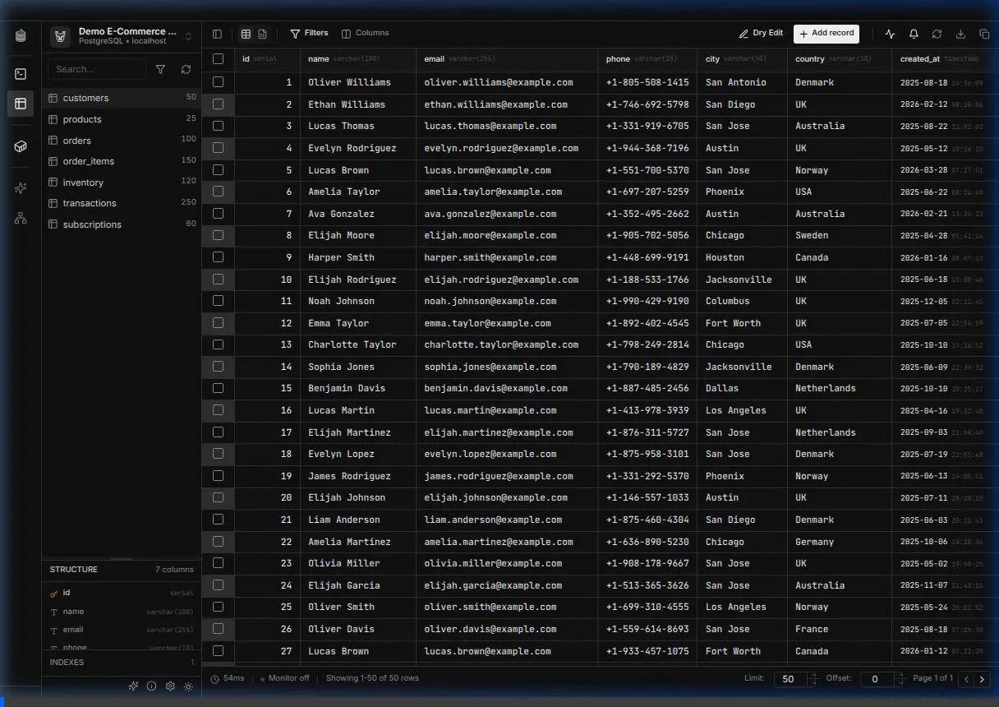

<div align="center">
  
  <h1>Dora</h1>
  <p><i>A clean, fast desktop database studio for people who actually work in data.</i></p>

[](https://www.rust-lang.org/)
[](https://tauri.app/)
[](https://react.dev/)
[](LICENSE)
[](https://github.com/remcostoeten/dora)

</div>

<p align="center">
  
</p>

Dora is a cross-platform database studio built with Tauri, Rust, React, and Monaco. It is designed for a native-feeling desktop workflow: fast navigation, direct editing, real SQL execution, clean table tooling, and a UI that stays out of your way.

## Why Dora

- Fast desktop UX without the weight of an Electron app
- Database Studio for browsing, editing, filtering, and managing tables
- SQL Console for running queries, mutations, and saved snippets
- Native desktop capabilities like file dialogs, exports, and secure local storage
- Real Tauri-backed database operations on desktop, with a browser mock path for Vercel demos

## What Dora Can Do

### Database Studio

- Browse schemas, tables, columns, indexes, and structure
- Edit cells inline
- Add, duplicate, and delete rows
- Stage and apply edits in bulk workflows
- Sort, filter, paginate, and inspect table data
- Export JSON, CSV, and SQL insert output
- Copy SQL schema and Drizzle schema output
- Add columns, drop tables, and run common table actions
- Seed tables with generated data
- Monitor live changes

### SQL Console

- Run `SELECT`, `INSERT`, `UPDATE`, `DELETE`, and DDL statements
- Work in a Monaco-based SQL editor
- Save snippets and organize them into folders
- View query history
- Filter results
- Export query results
- Edit or delete rows from supported single-table result sets

### Connectivity

- Save, edit, test, connect, and remove connections
- PostgreSQL support
- SQLite support
- LibSQL / Turso support
- Postgres SSH tunneling in the desktop app

### Docker Tools

- Create and manage PostgreSQL containers
- Start, stop, restart, inspect, and remove containers
- View logs and export compose-friendly details

## Platforms

Dora is a desktop app built with Tauri and targets:

- macOS
- Windows
- Linux

Release bundles are configured for:

- macOS: `.dmg`
- Windows: `.exe`, `.msi`
- Linux: `.AppImage`, `.deb`, `.rpm`

GitHub Releases: https://github.com/remcostoeten/dora/releases

## Installation

### Homebrew (macOS / Linux)

You can install Dora via Homebrew using our custom tap:

```bash
brew tap remcostoeten/dora
brew install dora
```

Or in a single command:

```bash
brew install remcostoeten/dora/dora
```

### Linux Packages

Dora releases also ship native Linux packages:

- `.deb` for Debian / Ubuntu
- `.rpm` for Fedora / RHEL / openSUSE
- `.AppImage` for portable Linux installs

Download the latest package from GitHub Releases:
https://github.com/remcostoeten/dora/releases/latest

Examples:

```bash
# Debian / Ubuntu
sudo apt install ./dora_*.deb
```

```bash
# Fedora / RHEL
sudo dnf install ./dora-*.rpm
```

```bash
# openSUSE
sudo zypper install ./dora-*.rpm
```

### Other Package Managers

These are possible, but are not published yet:

- Snap via Snapcraft
- APT repository metadata for Debian / Ubuntu
- YUM / DNF repository metadata for RPM-based distros
- Winget, Scoop, or Chocolatey for Windows
- AUR for Arch Linux

At the moment, Homebrew is the only package-manager install path wired up end-to-end in this repo. The other supported install path is downloading the release artifact directly.

Maintainer packaging docs:

- `docs/distribution/winget.md`
- `docs/distribution/aur.md`
- `docs/distribution/snap.md`
- `docs/distribution/one-machine-playbook.md`

## Database Support

| Database       |   Status    | Notes                                                                          |
| :------------- | :---------: | :----------------------------------------------------------------------------- |
| PostgreSQL     |  Supported  | Full desktop path, including SSH tunneling and live external change monitoring |
| SQLite         |  Supported  | Native desktop workflow                                                        |
| LibSQL / Turso |  Supported  | Local and remote flows                                                         |
| MySQL          | Not shipped | Scaffolded in parts of the codebase, not exposed as a supported feature        |

## Live Updates

Dora supports near-real-time table refresh behavior while you work:

- PostgreSQL uses external change notifications plus refresh logic in the desktop app
- SQLite and LibSQL use polling fallback

Details: [docs/live-change-monitoring.md](docs/live-change-monitoring.md)

## Desktop vs Browser Mode

The desktop app is the real product surface. That is where Tauri commands, native database access, SSH tunneling, exports, and local system integration run.

The browser/Vercel version exists as a mock/demo shell because this backend does not run in the browser. It is useful for previewing the interface, but it is not the same execution environment as the desktop app.

## Current Product Shape

This repo is already in strong beta territory for the desktop app:

- core connection management works
- core data editing works
- SQL execution works
- snippet storage works
- Postgres SSH tunnels work in desktop/Tauri mode
- Postgres live external updates are wired in

Known limits:

- MySQL is not a supported shipped path yet
- browser/Vercel mode does not run the Tauri backend
- some deeper destructive or database-specific edge cases still need continued hardening before calling the app fully release-clean

## Development

### Prerequisites

- Bun
- Rust toolchain
- Tauri system dependencies for your platform

### Install

```bash
bun install
```

### Run

```bash
# Web shell / mock mode
bun run web:dev

# Desktop app
bun run desktop:dev
```

### Validate

```bash
# Desktop tests
bun run test:desktop

# TypeScript
bun x tsc --noEmit -p apps/desktop/tsconfig.app.json

# Rust backend
cargo check --manifest-path apps/desktop/src-tauri/Cargo.toml
```

### Build

```bash
# Workspace build
bun run build

# Desktop release build
bun run desktop:build
```

## Repository Notes

- Desktop-specific notes live in [apps/desktop/README.md](apps/desktop/README.md)
- Audit notes live in [docs/app-audit-2026-02-20.md](docs/app-audit-2026-02-20.md)

## License

GNU General Public License v3.0. See [LICENSE](LICENSE).
