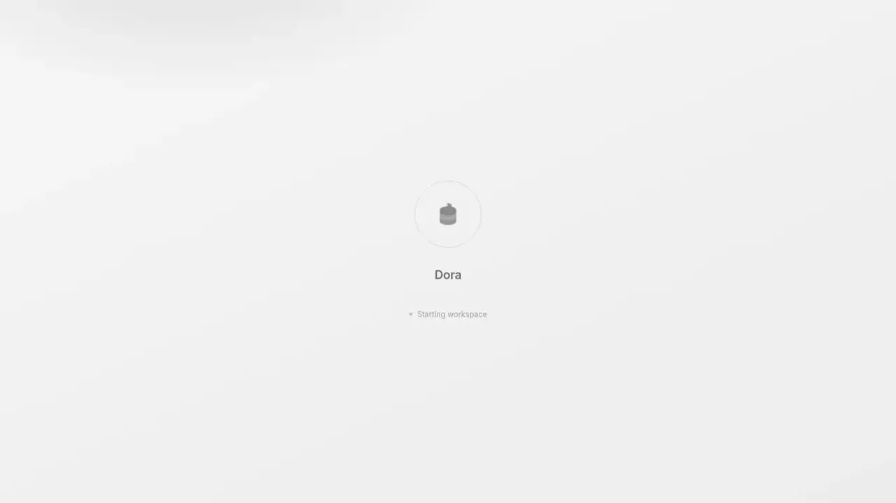

<div align="center">
  
  <h1>Dora</h1>
  <p><em>A native desktop database workbench that stays out of your way.</em></p>

[](https://github.com/remcostoeten/dora/releases)
[](https://github.com/remcostoeten/dora/releases)
[](LICENSE)
[](https://snapcraft.io/dora)
[](https://tauri.app/)

</div>

<p align="center">
  
</p>

Dora is a cross-platform database workbench built with Tauri and Rust. It ships as a **~10 MB binary** — versus the 100+ MB you get from Electron-based alternatives — and covers the full day-to-day loop without asking you to leave the app.

Connect to PostgreSQL, MySQL, MariaDB, CockroachDB, SQLite, libSQL/Turso, Cloudflare D1, and DuckDB. Open CSV, JSON, Parquet, and NDJSON as queryable data files. Sign in to a provider account — Supabase, Neon, Turso, PlanetScale, Vercel Postgres, Xata, or Cloudflare D1 — and pick a database without hunting for a connection string, or paste a string for any of 15+ auto-recognized hosted providers. Browse data, run SQL in a Monaco editor, generate SQL with AI, write ORM queries with Drizzle or Prisma, compare a Drizzle/Prisma schema against the live database and preview the migration, inspect schemas as an ER diagram, and manage local Docker databases — all keyboard-first.

## Install

**macOS**
```bash
brew install remcostoeten/tap/dora
```

**Windows**
```powershell
winget install RemcoStoeten.Dora
```

**Arch Linux**
```bash
yay -S dora
```

**Debian / Ubuntu**
```bash
curl -fsSL https://remcostoeten.github.io/dora/KEY.gpg \
  | sudo gpg --dearmor -o /etc/apt/keyrings/dora.gpg
echo "deb [arch=amd64 signed-by=/etc/apt/keyrings/dora.gpg] \
  https://remcostoeten.github.io/dora stable main" \
  | sudo tee /etc/apt/sources.list.d/dora.list
sudo apt update && sudo apt install dora
```

**Linux (Snap)**
```bash
sudo snap install dora
```

**Linux (Flatpak / AppImage / deb / rpm)** — download from the [releases page](https://github.com/remcostoeten/dora/releases).

## Database support

| Database | Status |
|---|---|
| PostgreSQL | Full support — SSH tunneling, live updates via LISTEN/NOTIFY |
| MySQL | Full support — SSH tunneling, live updates via polling |
| SQLite | Full support — native file picker |
| DuckDB | Full support — local `.duckdb` files, import CSV/JSON/Parquet as tables |
| libSQL / Turso | Full support — local and remote |
| MariaDB | Full support — MariaDB-aware dialect; native `UUID` / `INET4` / `INET6` types |
| CockroachDB | Full support — CockroachDB-aware schema introspection, live monitor auto-tuned |
| Cloudflare D1 | Full support — connects over Cloudflare's HTTP query API, no local file needed |
| Data files (CSV / TSV / Parquet / JSON / NDJSON) | DuckDB-backed sessions — query, export, cross-file JOINs; save as DuckDB to edit |

### Connect a provider account

Skip the connection string entirely. Sign in to a provider, and Dora lists your databases and mints the credential for you — the correct engine, dialect, and SSL are applied automatically.

| Provider | How you connect |
|---|---|
| Supabase | Connect your account (OAuth), pick a project |
| Neon | Add an API key, pick a project — branch-aware (choose a branch when a project has more than one) |
| Turso | Add a token (or mint one with the Turso CLI), pick a database |
| PlanetScale | Add a service token, pick a branch |
| Vercel Postgres | Add a token, pick a store |
| Xata | Add a key, pick a database |
| Cloudflare D1 | Add an API token, pick a database |

### Connection-string presets

Any other **hosted or serverless provider** is auto-recognized from its connection string — correct engine, dialect, and SSL applied for you, no native integration required:

Fly.io · Railway · Render · Aiven · DigitalOcean · Crunchy Bridge · Timescale · AWS RDS/Aurora · Azure Database · Google Cloud SQL · CockroachDB Cloud · TiDB Cloud · Yugabyte

They all speak standard Postgres/MySQL/libSQL — just paste the string. See [docs/architecture/data-sources.md](docs/architecture/data-sources.md).

## Features

### Data viewer

Browse schemas, tables, columns, indexes, and row data. Sort, filter (with AND/OR toggle), and paginate. Inline-edit cells, bulk-edit selections, set values to `NULL`, add/duplicate/delete rows, and stage changes in dry-run mode before committing. Export as JSON, CSV, or SQL `INSERT` — respecting your active filters and sort order. Back up a database to a `.sql` dump and restore from one.

### SQL console

Multi-tab workspace with isolated execution state. Monaco editor with autocomplete, syntax highlighting, and Vim keybindings. Run `SELECT`, `INSERT`, `UPDATE`, `DELETE`, and DDL. Filter result sets, switch between table and JSON view, export results. Tabs persist across relaunch and can be dragged to reorder.

### AI SQL generation

Press `⌘I` / `Ctrl+I`, describe what you want, get schema-grounded SQL back. Hit **Fix with AI** on a failed query to send the query and error to the assistant automatically. Supports **OpenAI, Anthropic, Gemini, Groq, and Ollama** — API keys are stored encrypted (AES-256-GCM) with the master key in the OS keychain. Ollama runs entirely offline, no key required. See [docs/ai-providers.md](docs/ai-providers.md).

### ORM runners

**Drizzle runner** — write and run Drizzle ORM queries with schema-aware autocomplete and a SQL preview before execution.

**Prisma runner** — write and execute Prisma Client queries natively inside Dora, with schema-aware autocomplete. No separate script file or `ts-node` needed.

### ORM cockpit

Link a project folder, and Dora detects your Drizzle or Prisma schema, parses it, and compares it against the live database. The **drift view** groups every difference by table and flags each change as safe, review, or destructive. From there it generates a reconciling migration — dialect-correct `up`/`down` SQL — with destructive and review statements gated behind explicit opt-in toggles. The preview is read-only: hand the SQL off to the SQL console with one click, where the normal execution guardrails apply. Nothing is run behind your back.

### Query history

Every query you run is stored, searchable, and re-runnable. History is scoped per connection.

### Schema visualizer

Interactive ER diagram with pan, zoom, FK edges, and a search that dims unrelated tables. Export to SVG or PNG — follows the active theme.

### Docker manager

Spin up a local PostgreSQL, MySQL, MariaDB, or CockroachDB container in one click, then start, stop, inspect, and remove it without leaving the app. Open a container directly in the data viewer, view logs, run seed scripts, or export a Docker Compose file.

### Local files

Dora distinguishes **database files** from **data files**:

| Open this | What you get |
|---|---|
| `.sqlite` / `.db` | Editable SQLite database |
| `.duckdb` | Editable DuckDB database — browse, edit rows, run SQL, import more files |
| CSV, JSON, Parquet, TSV, NDJSON | Readonly DuckDB-backed session — SQL queries, export, cross-file JOINs |

**Save as DuckDB** materializes a data-file session into a new `.duckdb` file on disk, then opens it as an editable connection. **Import files** pulls CSV/JSON/Parquet into physical tables on an existing DuckDB connection.

If a data file moves or goes missing, Dora shows connection health and lets you relocate or remove sources from the source panel without losing the connection entry.

### SSH tunneling

Connect to databases behind firewalls through encrypted SSH tunnels. Tunnel config is stored per connection alongside its credentials.

### Theming

Dark and light themes, custom accent colours, and configurable font sizes. Live preview, no restart required.

## Development

Dora is a Bun + Turborepo monorepo:

```
apps/
  desktop/   # Tauri app (Rust backend + React/TypeScript frontend)
  marketing/ # Next.js marketing site
packages/
  studio/    # @dora/studio — shared Studio package used by desktop and marketing demo
  style/     # Shared oxlint + oxfmt config
```

**Prerequisites:** [Bun](https://bun.sh), [Rust](https://rustup.rs), and the [Tauri prerequisites](https://tauri.app/start/prerequisites/) for your platform.

```bash
# Install dependencies
bun install

# Start the desktop app in development mode
bun run desktop:dev

# Run the marketing site
bun run --cwd apps/marketing dev
```

**Build**

```bash
bun run desktop:build                    # current platform
bun run desktop:build:linux              # AppImage + deb + rpm
bun run desktop:build:win                # nsis + msi
bun run desktop:build:mac                # dmg
```

**Tests**

```bash
bun test
```

> [!NOTE]
> The desktop app uses Vite as its dev server (`http://localhost:1420`). Hot-reload works for the TypeScript frontend; Rust changes require a full rebuild.

## Contributing

Bug reports, feature requests, and pull requests are welcome. Open an issue to discuss anything non-trivial before sending a PR.

For significant changes — new database support, new UI surfaces, changes to the Rust backend — please open an issue first so the approach can be agreed on.

## Platforms

macOS (Apple Silicon + Intel), Windows (x64), Linux (x64) via AppImage, deb, rpm, Snap, or Flatpak.

## License

GNU General Public License v3.0. See [LICENSE](LICENSE).
