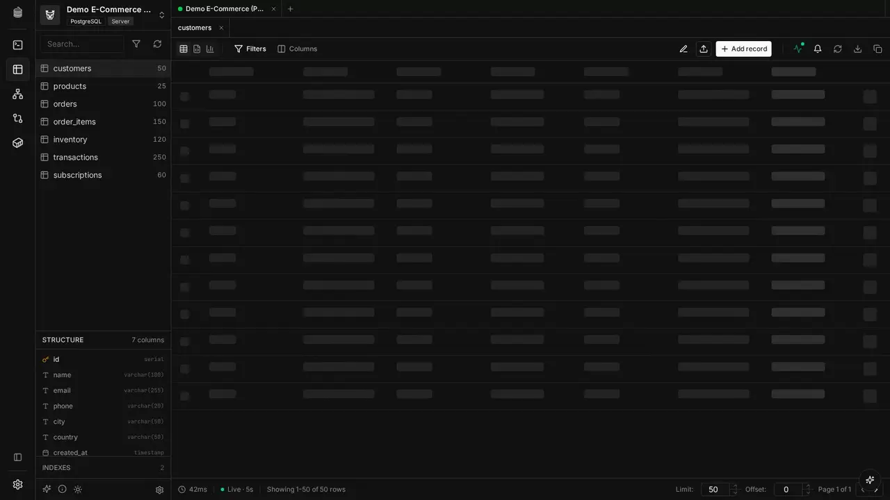

<p align="center">
  
</p>

<h1 align="center">Dora</h1>

<p align="center">
  <em>the database explorah</em>
</p>

<p align="center">
  A native database workbench for PostgreSQL, MySQL, MariaDB, CockroachDB,<br />
  SQLite, libSQL/Turso, Cloudflare D1, DuckDB, and CSV/JSON/Parquet files.<br />
  Rust and Tauri, so the installer is tens of megabytes, not hundreds.<br />
  Free and open source: no paid edition, no subscription, no feature gate.<br />
  <a href="https://doradb.app/downloads"><strong>doradb.app/downloads</strong></a> · <a href="https://doradb.app/docs">docs</a>
</p>

<p align="center">
  
  
  
  
  
  
</p>

<p align="center">
  
</p>
<p align="center">
  <sub>The studio, driven from the keyboard, captured in real time and uncut. The desktop app is the same interface on the Rust backend.</sub>
</p>

Dora talks to your database directly from your machine. Point it at a local
SQLite file, a Postgres server behind an SSH tunnel, or a hosted database you
never have to find a connection string for: sign in to Supabase, Neon, Turso,
PlanetScale, Vercel, Xata, or Cloudflare and pick a database from the list, and
the engine, dialect, and SSL settings are filled in for you. Everything is
keyboard-first.

- Browse, sort, filter, and **inline-edit** rows, with a dry-run mode that stages changes before they hit the database
- A multi-tab SQL console on Monaco, with autocomplete, Vim keybindings, and tabs that survive a relaunch
- **Schema-grounded AI SQL** on `⌘I` / `Ctrl+I`, through OpenAI, Anthropic, Gemini, Groq, or a fully offline Ollama
- Write **Drizzle and Prisma queries** natively, with schema-aware autocomplete and a SQL preview
- Diff a Drizzle or Prisma schema against the live database and generate the reconciling migration, destructive statements gated behind an explicit toggle
- Query CSV, JSON, Parquet, TSV, and NDJSON as tables, join across files, and materialize a session into a real DuckDB file
- Point it at a PostHog project and it becomes a desktop **HogQL client** with an analytics dashboard on top

Every feature is documented in full at
[doradb.app/docs](https://doradb.app/docs). The connection model is in
[data-sources.md](docs/architecture/data-sources.md), the analytics client in
[analytics.mdx](docs/features/analytics.mdx), and the AI setup in
[ai-providers.md](docs/ai-providers.md).

## Connect anything

<p align="center">
  
  
  
  
  
  
  
  
</p>

Every engine gets the same browse, edit, query, export, and dump flows, with
the parts that differ handled per dialect rather than lowest-common-denominator.

| Engine | What you get |
|---|---|
| PostgreSQL | SSH tunneling, live updates over `LISTEN`/`NOTIFY` |
| MySQL | SSH tunneling, live updates by polling |
| MariaDB | MariaDB-aware dialect, native `UUID` / `INET4` / `INET6` types |
| CockroachDB | CockroachDB-aware introspection, live monitor auto-tuned |
| SQLite | Native file picker, no server needed |
| libSQL / Turso | Local files and remote databases alike |
| Cloudflare D1 | Over Cloudflare's HTTP query API, no local file |
| DuckDB | Local `.duckdb` files, import CSV/JSON/Parquet as real tables |
| CSV · TSV · JSON · NDJSON · Parquet | DuckDB-backed sessions: query, cross-file joins, export, save as DuckDB to edit |

### Sign in instead of hunting for a connection string

<p align="center">
  
  
  
  
  
  
  
</p>

Connect the account once and Dora lists your databases, mints the credential,
and applies the right engine, dialect, and SSL mode for you.

| Provider | How you connect |
|---|---|
| Supabase | OAuth, then pick a project |
| Neon | API key, then pick a project and a branch |
| Turso | Token, or mint one with the Turso CLI, then pick a database |
| PlanetScale | Service token, then pick a branch |
| Vercel Postgres | Token, then pick a store |
| Xata | API key, then pick a database |
| Cloudflare D1 | API token, then pick a database |

Anything else hosted is recognized from the connection string alone, engine,
dialect, and SSL applied for you, no integration required:

Fly.io · Railway · Render · Aiven · DigitalOcean · Crunchy Bridge · Timescale ·
AWS RDS/Aurora · Azure Database · Google Cloud SQL · CockroachDB Cloud ·
TiDB Cloud · Yugabyte

Or skip the server entirely: spin up a local PostgreSQL, MySQL, MariaDB, or
CockroachDB container from inside the app, seed it, and open it in the data
viewer without touching a terminal.

## Install

Every build is at [doradb.app/downloads](https://doradb.app/downloads), or
through the channel you already use:

### macOS (Homebrew)

```bash
brew install remcostoeten/tap/dora
```

### Windows (Winget)

```powershell
winget install RemcoStoeten.Dora
```

### Arch Linux (AUR)

```bash
yay -S dora
```

### Debian / Ubuntu (APT)

```bash
curl -fsSL https://remco-stoeten.github.io/dora/KEY.gpg \
  | sudo gpg --dearmor -o /etc/apt/keyrings/dora.gpg
echo "deb [arch=amd64 signed-by=/etc/apt/keyrings/dora.gpg] \
  https://remco-stoeten.github.io/dora stable main" \
  | sudo tee /etc/apt/sources.list.d/dora.list
sudo apt update && sudo apt install dora
```

### Linux (Snap)

```bash
sudo snap install dora
```

Flatpak, AppImage, `.deb`, `.rpm`, `.dmg`, and `.msi` builds are on the
[releases page](https://github.com/remcostoeten/dora/releases/latest). macOS
builds cover Apple Silicon and Intel; Windows and Linux are x64.

## Privacy

**Your data never passes through a server of ours.** Queries run from your
machine to your database, and results stay in the app. Connection passwords,
provider tokens, SSH keys, and AI API keys are encrypted with AES-256-GCM under
a master key held in the OS keychain, falling back to a local key file only when
the platform has no keyring available.

The AI features are inert until you add a key. Ollama runs entirely offline;
the remote providers receive your prompt and the schema of the tables in scope,
never row data. PostHog connections are read-only: Dora queries the HogQL API
and never writes to it.

Release builds report anonymous page views to a first-party endpoint. No query
text, schema, credential, or row data is sent, and `Do Not Track` turns it off
with no action. There is no in-app toggle for it yet.

## Development

[Bun](https://bun.sh), [Rust](https://rustup.rs), and the
[Tauri prerequisites](https://tauri.app/start/prerequisites/) for your platform.
The repository is a Turborepo monorepo: `apps/desktop` is the Tauri app,
`apps/marketing` the Next.js site, and `packages/studio` the React interface
both share.

```bash
bun install
bun run desktop:dev      # Tauri app against Vite on :1420
bun run lint             # oxlint across the workspace
bun run test             # Vitest via Turborepo
```

Rust tests are `cargo test` inside `apps/desktop/src-tauri`. Use `bun run test`
rather than a bare `bun test`, which picks up Vitest and Playwright specs its
own runner cannot execute. CI runs lint, type checks, frontend and Rust tests, a
production build, and a browser boot smoke test, with a separate workflow
exercising the adapters against real MySQL and MariaDB servers.

<br/>

xxx,<br/>
[Remco Stoeten](https://remcostoeten.com)<br/>
GPLv3
