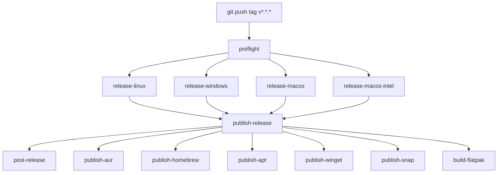

# Release Workflow

Dora ships through a tag-triggered GitHub Actions pipeline. You create and push a semver tag; CI builds every platform, publishes the GitHub release, updates repo docs, and fans out to package managers.

**Workflow file:** [`.github/workflows/release.yml`](../../.github/workflows/release.yml)  
**Release notes config:** [`.github/release.yml`](../../.github/release.yml)

---

## Quick start

Bump versions in the repo first (see [Pre-release checklist](#pre-release-checklist)), then:

```bash
git tag v0.27.0
git push origin v0.27.0
```

That is the only manual trigger. Everything else runs automatically.

For an interactive preflight (branch, dirty tree, version sync, GitHub auth):

```bash
bun run release:guide
# or: bash tools/scripts/release-guide.sh
```

---

## Pipeline overview



| Phase | Job | Runs on | Purpose |
| --- | --- | --- | --- |
| 0 | *(manual)* | local | Create and push semver tag |
| 1 | `preflight` | `ubuntu-latest` | Validate metadata before any build |
| 2 | `release-linux` | `ubuntu-latest` | Linux installers + tarball |
| 2 | `release-windows` | `windows-latest` | Windows `.msi` + `.exe` |
| 2 | `release-macos` | `macos-latest` | macOS ARM `.dmg` |
| 2 | `release-macos-intel` | `macos-13` | macOS Intel `.dmg` |
| 3 | `publish-release` | `ubuntu-latest` | Upload assets, create GitHub release |
| 4 | `post-release` | `ubuntu-latest` | Changelog, README, in-app data, commit to `master` |
| 5 | package managers | `ubuntu-latest` | Dispatch AUR, Homebrew, APT, Winget, Snap, Flatpak |

Platform builds in phase 2 run **in parallel** after preflight passes. Package-manager dispatches in phase 5 also run **in parallel** after the GitHub release is published.

---

## Phase 0 — Tag the release

1. Ensure `master` contains everything you want to ship.
2. Align version fields (see checklist below).
3. Tag and push:

```bash
git tag v0.27.0
git push origin v0.27.0
```

Tags must match `vMAJOR.MINOR.PATCH` (plain semver, no suffix). Pushing the tag starts the `Release` workflow.

Do **not** create or publish the GitHub release by hand. Manual publication before CI finishes is the main failure mode for APT, AUR, Homebrew, and Winget (they expect release assets to exist).

---

## Phase 1 — `preflight`

Fails fast before any expensive build starts.

### Version checks

| Source | Path |
| --- | --- |
| Git tag | `v0.27.0` → `0.27.0` |
| Desktop package | `apps/desktop/package.json` |
| Tauri config | `apps/desktop/src-tauri/tauri.conf.json` |
| Cargo manifest | `apps/desktop/src-tauri/Cargo.toml` |

The tag version must equal the desktop, Tauri, and Cargo versions. A mismatch aborts the workflow.

Root `package.json` is checked separately; if it differs, CI logs a warning but continues (desktop/Tauri/Cargo are authoritative for release assets).

### Bundle and packaging checks

Preflight also verifies:

- Required Tauri bundle targets: `deb`, `rpm`, `appimage`, `nsis`, `msi`, `dmg`
- Distribution files exist (AUR PKGBUILD, desktop entry, Snap/Flatpak manifests, generator scripts)

---

## Phase 2 — Platform builds

Four jobs run in parallel. Each job:

1. Checks out the repo
2. Installs Bun, Rust, and platform-specific dependencies
3. Runs `bun install` and `bun run build` in `apps/desktop`
4. Runs `tauri build` via `tauri-apps/tauri-action`
5. Uploads build artifacts

### Linux (`release-linux`)

**Runner:** `ubuntu-latest`

**Outputs:**

| Asset | Description |
| --- | --- |
| `.deb` | Debian package |
| `.rpm` | RPM package |
| `.AppImage` | Portable Linux build |
| `dora-x86_64-unknown-linux-gnu.tar.gz` | Lightweight tarball for AUR (binary extracted from the `.deb`) |
| `checksums-linux.txt` | Checksums for AppImage, deb, rpm |

### Windows (`release-windows`)

**Runner:** `windows-latest`

**Outputs:**

| Asset | Description |
| --- | --- |
| `.msi` | Windows installer |
| `.exe` | NSIS installer |
| `checksums-windows.txt` | Checksums for msi, exe |

### macOS ARM (`release-macos`)

**Runner:** `macos-latest`

**Outputs:** `.dmg` for Apple Silicon.

### macOS Intel (`release-macos-intel`)

**Runner:** `macos-13`

**Outputs:** `.dmg` for Intel Macs.

---

## Phase 3 — `publish-release`

Waits for all four platform jobs, then:

1. **Downloads** every artifact from the workflow run
2. **Validates** the asset set:
   - At least **10** files total
   - At least one `.msi`
   - At least one `.exe`
3. **Creates the GitHub release** with:

```bash
gh release create v0.27.0 \
  --title "Dora v0.27.0" \
  --generate-notes \
  <all assets...>
```

`--generate-notes` pulls merged PRs since the previous tag and groups them using [`.github/release.yml`](../../.github/release.yml).

If an empty pre-created release exists for the tag, CI deletes it and recreates. If a release already has assets, the job fails rather than overwrite.

---

## Phase 4 — `post-release`

Runs on `master` after the release is published.

1. **Fetches** the generated release body from GitHub
2. **Normalises** the text:
   - Strips PR author attribution (`by @user in #123`)
   - Converts `*` list markers to `-` (for changelog parsing)
   - Drops "Full Changelog", "New Contributors", and "What's Changed" boilerplate
3. **Prepends** a new block to `CHANGELOG.md`:

```markdown
## [v0.27.0] - 2026-06-06

<normalised release notes>
```

4. **Updates** `README.md`:
   - Replaces `<version>` placeholder
   - Updates any previously hardcoded semver strings
5. **Regenerates** in-app changelog data:

```bash
bun run generate:changelog-data
```

This updates:

- `packages/studio/src/features/sidebar/changelog-data.ts`
- `apps/marketing/src/core/content/changelog-data.ts`

6. **Commits and pushes** to `master`:

```
chore(release): v0.27.0
```

---

## Phase 5 — Package manager dispatches

These jobs run in parallel after `publish-release` succeeds. Each dispatches a dedicated workflow on `master` with the release tag:

| Job | Workflow | Notes |
| --- | --- | --- |
| `publish-aur` | `aur.yml` | Arch User Repository |
| `publish-homebrew` | `brew.yml` | `publish=true` |
| `publish-apt` | `apt.yml` | `publish=true` |
| `publish-winget` | `winget.yml` | `submit_update=true` |
| `publish-snap` | `snap.yml` | `publish=true`, `release_channel=stable` |
| `build-flatpak` | `flatpak.yml` | Uploads `.flatpak` to the GitHub release |

No manual repackaging is required per release. See [All distribution channels](#all-distribution-channels) below and [Appendix: package manager recovery](#appendix-package-manager-recovery-historic) if a store listing breaks.

---

## All distribution channels

Not everything is a separate “package manager workflow.” A tagged release produces **GitHub release assets** first; six **store/registry workflows** fan out from there.

### GitHub Releases (automatic — no extra workflow)

Built by `release.yml` and attached to every release. Users install directly from the release page:

| Asset | Platform | Store workflow |
| --- | --- | --- |
| `.dmg` (Apple Silicon + Intel) | macOS | Also feeds Homebrew |
| `.msi`, `.exe` | Windows | Also feeds Winget |
| `.deb` | Debian/Ubuntu | Also feeds APT repo |
| `.rpm` | Fedora/RHEL/openSUSE | **Direct download only** — no COPR/RPM-repo workflow |
| `.AppImage` | Linux portable | Direct download only |
| `dora-x86_64-unknown-linux-gnu.tar.gz` | Arch tarball | Also feeds AUR |
| `checksums-linux.txt`, `checksums-windows.txt` | All | Used by Winget manifest generation |

### Store / registry (automatic — dispatched after publish)

| Channel | Workflow | Install example |
| --- | --- | --- |
| AUR | `aur.yml` | `yay -S dora` |
| Homebrew | `brew.yml` | `brew install --cask remcostoeten/dora/dora` |
| APT | `apt.yml` | `apt install dora` (GitHub Pages repo) |
| Winget | `winget.yml` | `winget install RemcoStoeten.Dora` |
| Snap | `snap.yml` | `snap install dora` |
| Flatpak bundle | `flatpak.yml` | `flatpak install --user Dora-<version>-x86_64.flatpak` from the release |

### External or not automated in this repo

| Channel | Status |
| --- | --- |
| **Flathub** (`flatpak install flathub …`) | Separate submission/review — not the same as the GitHub-release `.flatpak` from `flatpak.yml` |
| **Scoop** | Not implemented — no workflow or manifest in repo |
| **Chocolatey** | Not implemented — no workflow or manifest in repo |
| **Fedora COPR / RPM repository** | Not implemented — `.rpm` is on GitHub Releases only |

The appendix below covers recovery for the six automated store workflows only. GitHub release assets are rebuilt automatically whenever `release.yml` succeeds; you only need to re-bootstrap a store if its listing or secrets are lost.

---

## Release notes and PR labels

The only ongoing manual discipline for meaningful release notes: **label every PR before merge**.

GitHub groups auto-generated notes by label (configured in `.github/release.yml`). PRs without a matching label land in **Other Changes**.

| Category | Labels |
| --- | --- |
| New Features | `feat`, `feature`, `enhancement` |
| Bug Fixes | `fix`, `bug`, `bugfix` |
| Performance | `perf`, `performance` |
| Improvements | `refactor`, `improvement`, `dx` |
| Dependencies | `dependencies`, `deps` |
| CI/CD | `ci`, `cd` |
| Documentation | `docs`, `documentation` |
| Other Changes | everything else |

One label per PR is enough. Pick the label that best describes user-visible impact.

---

## Pre-release checklist

Before tagging:

- [ ] All intended changes are merged to `master`
- [ ] Working tree is clean (`git status`)
- [ ] Versions match across:
  - [ ] `apps/desktop/package.json`
  - [ ] `apps/desktop/src-tauri/tauri.conf.json`
  - [ ] `apps/desktop/src-tauri/Cargo.toml`
- [ ] Every merged PR since the last release has an appropriate label
- [ ] GitHub CLI auth works if running the interactive guide locally

Optional: run `bun run release:guide` for an automated sanity check.

---

## What a successful release produces

**GitHub release page**

- Linux: deb, rpm, AppImage, tarball, checksums
- Windows: msi, exe, checksums
- macOS: ARM and Intel dmg files

**Repo updates (via `post-release`)**

- New `CHANGELOG.md` entry at the top
- Updated `README.md` version strings
- Regenerated TypeScript changelog data for studio and marketing

**Downstream**

- Package manager workflows triggered with the new tag

---

## Troubleshooting

### Preflight fails on version mismatch

Update `apps/desktop/package.json`, `tauri.conf.json`, and `Cargo.toml` to the same semver, commit, then tag again.

### `publish-release` fails: fewer than 10 assets

One or more platform jobs failed or produced incomplete artifacts. Open the failed platform job log first.

### Missing `.msi` or `.exe`

The Windows job failed or did not upload NSIS/MSI bundles. Check `release-windows` logs and Tauri bundle targets in `tauri.conf.json`.

### Package manager workflow fails immediately

Usually means the GitHub release or its assets are not ready yet. Confirm `publish-release` finished and the release page lists all installers before debugging AUR/Homebrew/APT/Winget.

### Release notes are all "Other Changes"

PRs were merged without labels. Label PRs before merge on the next release cycle; retroactive labeling does not rewrite an already-published release body (but `post-release` will still sync whatever GitHub generated into `CHANGELOG.md`).

### `post-release` did not commit

Either nothing changed (files already matched) or the push to `master` failed. Check the `post-release` job log and branch protection rules.

---

## Related

- Interactive preflight: `bun run release:guide`
- AI-assisted release notes draft: `.agent/workflows/release.md`
- Agent guidelines for labels and changelog tone: `.agent/AGENTS.md`

---

## Appendix: Package manager recovery (historic)

> **Historic reference only.** Package manager publishing is already configured and runs automatically on every tagged release. You do not need this section for normal releases, and nobody should clone the repo to repackage or publish manually.
>
> **Read this only if** a channel was removed from a store/registry, GitHub secrets expired, or CI can no longer publish to that channel and you need to bootstrap it again.

### AUR

**Workflow:** `.github/workflows/aur.yml`  
**Package:** `dora` on AUR, built from `dora-x86_64-unknown-linux-gnu.tar.gz` on the GitHub release.

1. Create the `dora` package at [aur.archlinux.org](https://aur.archlinux.org).
2. Generate a deploy key: `ssh-keygen -t ed25519 -C "github-actions-aur" -f ./aur_deploy_key`
3. Add the public key to your AUR account.
4. Set GitHub secrets:
   - `AUR_SSH_PRIVATE_KEY`
   - `AUR_KNOWN_HOSTS` (pinned `aur.archlinux.org` entry)
5. Helper script: `bash packaging/aur/setup-aur-publishing.sh`
6. Tag a release — `aur.yml` updates `packaging/aur/PKGBUILD`, commits to this repo, and pushes to AUR.

Local validation: `cd packaging/aur && makepkg -si`, or `bash tools/scripts/test-aur-docker.sh`.

### Homebrew

**Workflow:** `.github/workflows/brew.yml`  
**Tap:** `remcostoeten/homebrew-dora`

1. Create the tap repo if it does not exist.
2. Set GitHub secret `HOMEBREW_SSH_PRIVATE_KEY` (deploy key with push access to the tap).
3. Tag a release — `brew.yml` generates the Cask from release DMGs and pushes to the tap when `publish=true`.

### APT

**Workflow:** `.github/workflows/apt.yml`

1. Enable GitHub Pages on the repository.
2. Set GitHub secret `GPG_PRIVATE_KEY` for signing the repo metadata.
3. Tag a release — `apt.yml` builds the repo from the release `.deb` and deploys to Pages when `publish=true`.

### Winget

**Workflow:** `.github/workflows/winget.yml`  
**Package ID:** `RemcoStoeten.Dora`

First-time bootstrap (Windows, one-time):

```powershell
winget install wingetcreate
wingetcreate new "https://github.com/remcostoeten/dora/releases/download/vX.Y.Z/Dora_X.Y.Z_x64_en-US.msi"
```

After the `microsoft/winget-pkgs` PR merges:

1. Set GitHub secret `WINGET_CREATE_GITHUB_TOKEN` (classic PAT, `public_repo` scope).
2. Set repository variable `WINGET_PACKAGE_READY=true`.
3. Tag a release — `winget.yml` generates manifests and submits update PRs automatically.

### Snap

**Workflow:** `.github/workflows/snap.yml`  
**Manifest:** `snap/snapcraft.yaml`

1. Register the `dora` snap name on Snapcraft.
2. Export credentials:

```bash
snapcraft export-login --snaps=dora \
  --acls package_access,package_push,package_update,package_release \
  exported.txt
```

3. Set GitHub secret `SNAPCRAFT_STORE_CREDENTIALS` to the contents of `exported.txt`.
4. Tag a release — CI builds with `snapcraft pack --destructive-mode` on `ubuntu-22.04` and publishes to the stable channel.

### Flatpak (GitHub release bundle)

**Workflow:** `.github/workflows/flatpak.yml`  
**App ID:** `io.github.remcostoeten.dora`  
**Manifest:** `packaging/flatpak/io.github.remcostoeten.dora.yml`

CI uploads `Dora-<version>-x86_64.flatpak` to each GitHub release. Local build helper: `bun run release:flatpak:build`.

### Flathub (not automated here)

**Status:** separate from `flatpak.yml`. The workflow above puts a bundle on GitHub Releases; getting `flatpak install flathub io.github.remcostoeten.dora` working requires a Flathub submission and review using the in-repo manifest as source.

### Not implemented (no recovery steps)

Scoop, Chocolatey, and a hosted RPM repository (COPR etc.) were considered but have no workflows or packaging manifests in this repo. Linux RPM users install from the `.rpm` on GitHub Releases.

### Optional: VM lab

If you need isolated OS environments for debugging packaging (not for normal releases):

```bash
bun run vm:lab
# or: bash tools/scripts/vm-lab.sh
```

Managed VMs live under `.cache/dora-vm-lab/`. See `tools/scripts/vm-lab.sh --help` for subcommands.
