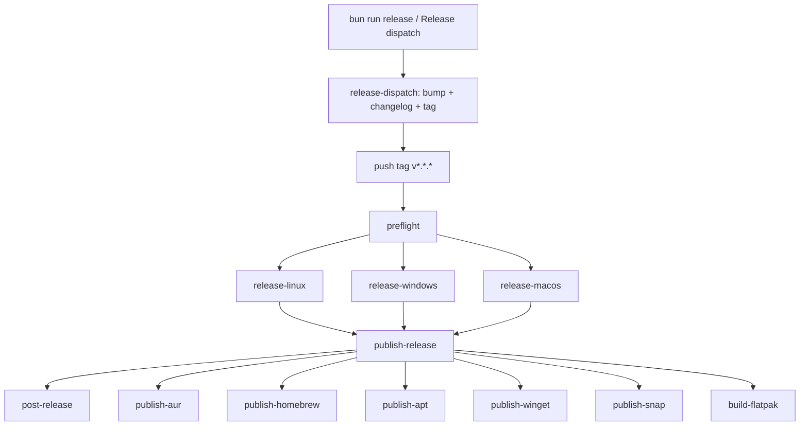

# Release Workflow

Dora ships through a tag-triggered GitHub Actions pipeline. You create and push a semver tag; CI builds every platform, publishes the GitHub release, updates repo docs, and fans out to package managers.

**Workflow file:** [`.github/workflows/release.yml`](../../.github/workflows/release.yml)
**Release notes config:** [`.github/release.yml`](../../.github/release.yml)
**Curated release notes:** [`.github/release-notes/`](../../.github/release-notes)

---

## Quick start

From your machine (requires `gh` CLI):

```bash
bun run release          # patch bump (default)
bun run release minor    # minor bump
bun run release major    # major bump
```

That dispatches the **Release dispatch** workflow, which:

1. Bumps version files on `master`
2. Prepends a `git-cliff` section to `CHANGELOG.md` (via `cliff.toml`)
3. Syncs in-app changelog TypeScript data
4. Commits, tags, and pushes
5. Triggers the **Release** workflow to build and publish assets

You can also start it from GitHub: **Actions → Release dispatch → Run workflow**.

For a local dry-run without pushing:

```bash
bash scripts/release-prepare.sh patch
```

For an interactive preflight (branch, dirty tree, version sync, GitHub auth):

```bash
bun run release:guide
# or: bash tools/scripts/release-guide.sh
```

---

## Pipeline overview



| Phase | Job | Runs on | Purpose |
| --- | --- | --- | --- |
| 0 | `release-dispatch` | `ubuntu-latest` | Bump versions, `CHANGELOG.md`, tag, push |
| 1 | `preflight` | `ubuntu-latest` | Validate metadata before any build |
| 2 | `release-linux` | `ubuntu-latest` | Linux installers + tarball |
| 2 | `release-windows` | `windows-latest` | Windows `.msi` + `.exe` |
| 2 | `release-macos` | `macos-latest` | macOS ARM `.dmg` |
| 3 | `publish-release` | `ubuntu-latest` | Upload assets, create GitHub release |
| 4 | `post-release` | `ubuntu-latest` | Update `README.md` on `master` |
| 5 | package managers | `ubuntu-latest` | Dispatch AUR, Homebrew, APT, Winget, Snap, Flatpak |

Platform builds in phase 2 run **in parallel** after preflight passes. Package-manager dispatches in phase 5 also run **in parallel** after the GitHub release is published.

---

## Phase 0 — Dispatch the release

1. Ensure `master` contains everything you want to ship.
2. Working tree is clean locally (CI enforces this too).
3. Run `bun run release` (or dispatch **Release dispatch** in GitHub Actions).

The dispatch job bumps `package.json`, desktop/Tauri/Cargo versions, prepends a `git-cliff` entry to `CHANGELOG.md`, syncs in-app changelog data, commits `chore(release): vX.Y.Z`, creates the tag, and pushes `master` + the tag.

Tags must match `vMAJOR.MINOR.PATCH` (plain semver, no suffix). Pushing the tag starts the `Release` workflow.

Do **not** create or publish the GitHub release by hand. Manual publication before CI finishes is the main failure mode for APT, AUR, Homebrew, and Winget (they expect release assets to exist).

**Emergency re-tag only:** `tag-create.yml` tags an existing SHA without version bumps — use only when recovering a broken release, not for normal shipping.

---

## Phase 1 — `preflight`

Fails fast before any expensive build starts.

### Version checks

| Source | Path |
| --- | --- |
| Git tag | `v0.27.0` → `0.27.0` |
| Desktop package | `apps/desktop/package.json` |
| Tauri config | `apps/desktop/src-tauri/tauri.conf.json` |
| Cargo manifest | `apps/desktop/src-tauri/Cargo.toml` |

The tag version must equal the desktop, Tauri, and Cargo versions. A mismatch aborts the workflow.

Root `package.json` is checked separately; if it differs, CI logs a warning but continues (desktop/Tauri/Cargo are authoritative for release assets).

### Bundle and packaging checks

Preflight also verifies:

- Required Tauri bundle targets: `deb`, `rpm`, `appimage`, `nsis`, `msi`, `dmg`
- Distribution files exist (AUR PKGBUILD, desktop entry, Snap/Flatpak manifests, generator scripts)

---

## Phase 2 — Platform builds

Four jobs run in parallel. Each job:

1. Checks out the repo
2. Installs Bun, Rust, and platform-specific dependencies
3. Runs `bun install` and `bun run build` in `apps/desktop`
4. Runs `tauri build` via `tauri-apps/tauri-action`
5. Uploads build artifacts

### Linux (`release-linux`)

**Runner:** `ubuntu-latest`

**Outputs:**

| Asset | Description |
| --- | --- |
| `.deb` | Debian package |
| `.rpm` | RPM package |
| `.AppImage` | Portable Linux build |
| `dora-x86_64-unknown-linux-gnu.tar.gz` | Lightweight tarball for AUR (binary extracted from the `.deb`) |
| `checksums-linux.txt` | Checksums for AppImage, deb, rpm |

### Windows (`release-windows`)

**Runner:** `windows-latest`

**Outputs:**

| Asset | Description |
| --- | --- |
| `.msi` | Windows installer |
| `.exe` | NSIS installer |
| `checksums-windows.txt` | Checksums for msi, exe |

### macOS ARM (`release-macos`)

**Runner:** `macos-latest`

**Outputs:** `.dmg` for Apple Silicon.

### macOS Intel (`release-macos-intel`)

**Runner:** `macos-15-intel`

**Outputs:** `.dmg` for Intel Macs.

---

## Phase 3 — `publish-release`

Waits for all four platform jobs, then:

1. **Downloads** every artifact from the workflow run
2. **Validates** the asset set:
   - At least **9** files total
   - At least one `.msi`
   - At least one `.exe`
3. **Creates the GitHub release** with `git-cliff` notes from `cliff.toml` (or curated `.github/release-notes/<tag>.md` when present):

```bash
git-cliff v0.27.0..v0.28.0 > /tmp/release-notes.md
gh release create v0.28.0 \
  --title "Dora v0.28.0" \
  --notes-file /tmp/release-notes.md \
  <all assets...>
```

If `.github/release-notes/<tag>.md` exists, that file is used instead of git-cliff output.

If an empty pre-created release exists for the tag, CI deletes it and recreates. If a release already has assets, the job fails rather than overwrite.

---

## Phase 4 — `post-release`

Runs on `master` after the release is published.

1. **Updates** `README.md`:
   - Replaces `<version>` placeholder
   - Updates any previously hardcoded semver strings

`CHANGELOG.md` and in-app changelog data are already committed by **Release dispatch** before the tag is pushed.

2. **Commits and pushes** to `master` when README changed:

```
chore(release): update README for v0.27.0
```

---

## Phase 5 — Package manager dispatches

These jobs run in parallel after `publish-release` succeeds. Each dispatches a dedicated workflow on `master` with the release tag:

| Job | Workflow | Notes |
| --- | --- | --- |
| `publish-aur` | `aur.yml` | Arch User Repository |
| `publish-homebrew` | `brew.yml` | `publish=true` |
| `publish-apt` | `apt.yml` | `publish=true` |
| `publish-winget` | `winget.yml` | `submit_update=true` |
| `publish-snap` | `snap.yml` | `publish=true`, `release_channel=stable` |
| `build-flatpak` | `flatpak.yml` | Uploads `.flatpak` to the GitHub release |

No manual repackaging is required per release. See [All distribution channels](#all-distribution-channels) below and [Appendix: package manager recovery](#appendix-package-manager-recovery-historic) if a store listing breaks.

---

## All distribution channels

Not everything is a separate “package manager workflow.” A tagged release produces **GitHub release assets** first; six **store/registry workflows** fan out from there.

### GitHub Releases (automatic — no extra workflow)

Built by `release.yml` and attached to every release. Users install directly from the release page:

| Asset | Platform | Store workflow |
| --- | --- | --- |
| `.dmg` (Apple Silicon + Intel) | macOS | Also feeds Homebrew |
| `.msi`, `.exe` | Windows | Also feeds Winget |
| `.deb` | Debian/Ubuntu | Also feeds APT repo |
| `.rpm` | Fedora/RHEL/openSUSE | **Direct download only** — no COPR/RPM-repo workflow |
| `.AppImage` | Linux portable | Direct download only |
| `dora-x86_64-unknown-linux-gnu.tar.gz` | Arch tarball | Also feeds AUR |
| `checksums-linux.txt`, `checksums-windows.txt` | All | Used by Winget manifest generation |

### Store / registry (automatic — dispatched after publish)

| Channel | Workflow | Install example |
| --- | --- | --- |
| AUR | `aur.yml` | `yay -S dora` |
| Homebrew | `brew.yml` | `brew install --cask remcostoeten/dora/dora` |
| APT | `apt.yml` | `apt install dora` (GitHub Pages repo) |
| Winget | `winget.yml` | `winget install RemcoStoeten.Dora` |
| Snap | `snap.yml` | `snap install dora` |
| Flatpak bundle | `flatpak.yml` | `flatpak install --user Dora-<version>-x86_64.flatpak` from the release |

### External or not automated in this repo

| Channel | Status |
| --- | --- |
| **Flathub** (`flatpak install flathub …`) | Separate submission/review — not the same as the GitHub-release `.flatpak` from `flatpak.yml` |
| **Scoop** | Not implemented — no workflow or manifest in repo |
| **Chocolatey** | Not implemented — no workflow or manifest in repo |
| **Fedora COPR / RPM repository** | Not implemented — `.rpm` is on GitHub Releases only |

The appendix below covers recovery for the six automated store workflows only. GitHub release assets are rebuilt automatically whenever `release.yml` succeeds; you only need to re-bootstrap a store if its listing or secrets are lost.

---

## Release notes and commit messages

Release notes are generated by **git-cliff** using [`cliff.toml`](../../cliff.toml). Commits are grouped by message prefix:

| Prefix | Section |
| --- | --- |
| `feat` | Features |
| `fix` | Bug Fixes |
| `docs` | Documentation |
| `perf` | Performance |
| `refactor` | Refactoring |
| `test` | Testing |
| `chore` | Chores |
| `ci` | CI/CD |
| `style` | Styling |
| `build` | Build |
| *(other)* | Other |

`chore(release)`, WIP, and merge commits are skipped.

For releases that need a fuller human summary, add `.github/release-notes/<tag>.md` before dispatching. The publish job uses that file instead of git-cliff output.

---

## Pre-release checklist

Before dispatching:

- [ ] All intended changes are merged to `master`
- [ ] Working tree is clean (`git status`)
- [ ] Commit messages since the last tag use recognizable prefixes (`feat`, `fix`, `docs`, …)
- [ ] GitHub CLI auth works if running `bun run release` locally

Optional: run `bun run release:guide` for an automated sanity check.

---

## What a successful release produces

**GitHub release page**

- Linux: deb, rpm, AppImage, tarball, checksums
- Windows: msi, exe, checksums
- macOS: ARM `.dmg`

**Repo updates**

- New `CHANGELOG.md` entry (from Release dispatch, before the tag)
- Updated `README.md` version strings (from `post-release`)
- Regenerated TypeScript changelog data (from Release dispatch)

**Downstream**

- Package manager workflows triggered with the new tag

---

## Troubleshooting

### Preflight fails on version mismatch

Update `apps/desktop/package.json`, `tauri.conf.json`, and `Cargo.toml` to the same semver, commit, then tag again.

### `publish-release` fails: fewer than 9 assets

One or more platform jobs failed or produced incomplete artifacts. Open the failed platform job log first.

### Missing `.msi` or `.exe`

The Windows job failed or did not upload NSIS/MSI bundles. Check `release-windows` logs and Tauri bundle targets in `tauri.conf.json`.

### Package manager workflow fails immediately

Usually means the GitHub release or its assets are not ready yet. Confirm `publish-release` finished and the release page lists all installers before debugging AUR/Homebrew/APT/Winget.

### Release notes are mostly "Other"

Commits since the last tag don't use recognized prefixes (`feat`, `fix`, `docs`, …). Use those prefixes in commit messages going forward.

### `post-release` did not commit

README version strings already matched, so nothing changed. Check the `post-release` job log and branch protection rules if a push failed.

---

## Related

- Interactive preflight: `bun run release:guide`
- AI-assisted release notes draft: `.agent/workflows/release.md`
- Agent guidelines for labels and changelog tone: `.agent/AGENTS.md`

---

## Appendix: Package manager recovery (historic)

> **Historic reference only.** Package manager publishing is already configured and runs automatically on every tagged release. You do not need this section for normal releases, and nobody should clone the repo to repackage or publish manually.
>
> **Read this only if** a channel was removed from a store/registry, GitHub secrets expired, or CI can no longer publish to that channel and you need to bootstrap it again.

### AUR

**Workflow:** `.github/workflows/aur.yml`  
**Package:** `dora` on AUR, built from `dora-x86_64-unknown-linux-gnu.tar.gz` on the GitHub release.

1. Create the `dora` package at [aur.archlinux.org](https://aur.archlinux.org).
2. Generate a deploy key: `ssh-keygen -t ed25519 -C "github-actions-aur" -f ./aur_deploy_key`
3. Add the public key to your AUR account.
4. Set GitHub secrets:
   - `AUR_SSH_PRIVATE_KEY`
   - `AUR_KNOWN_HOSTS` (pinned `aur.archlinux.org` entry)
5. Helper script: `bash packaging/aur/setup-aur-publishing.sh`
6. Tag a release — `aur.yml` updates `packaging/aur/PKGBUILD`, commits to this repo, and pushes to AUR.

Local validation: `cd packaging/aur && makepkg -si`, or `bash tools/scripts/test-aur-docker.sh`.

### Homebrew

**Workflow:** `.github/workflows/brew.yml`  
**Tap:** `remcostoeten/homebrew-dora`

1. Create the tap repo if it does not exist.
2. Set GitHub secret `HOMEBREW_SSH_PRIVATE_KEY` (deploy key with push access to the tap).
3. Tag a release — `brew.yml` generates the Cask from release DMGs and pushes to the tap when `publish=true`.

### APT

**Workflow:** `.github/workflows/apt.yml`

1. Enable GitHub Pages on the repository.
2. Set GitHub secret `GPG_PRIVATE_KEY` for signing the repo metadata.
3. Tag a release — `apt.yml` builds the repo from the release `.deb` and deploys to Pages when `publish=true`.

### Winget

**Workflow:** `.github/workflows/winget.yml`  
**Package ID:** `RemcoStoeten.Dora`

First-time bootstrap (Windows, one-time):

```powershell
winget install wingetcreate
wingetcreate new "https://github.com/remcostoeten/dora/releases/download/vX.Y.Z/Dora_X.Y.Z_x64_en-US.msi"
```

After the `microsoft/winget-pkgs` PR merges:

1. Set GitHub secret `WINGET_CREATE_GITHUB_TOKEN` (classic PAT, `public_repo` scope).
2. Set repository variable `WINGET_PACKAGE_READY=true`.
3. Tag a release — `winget.yml` generates manifests and submits update PRs automatically.

### Snap

**Workflow:** `.github/workflows/snap.yml`  
**Manifest:** `snap/snapcraft.yaml`

1. Register the `dora` snap name on Snapcraft.
2. Export credentials:

```bash
snapcraft export-login --snaps=dora \
  --acls package_access,package_push,package_update,package_release \
  exported.txt
```

3. Set GitHub secret `SNAPCRAFT_STORE_CREDENTIALS` to the contents of `exported.txt`.
4. Tag a release — CI builds with `snapcraft pack --destructive-mode` on `ubuntu-22.04` and publishes to the stable channel.

### Flatpak (GitHub release bundle)

**Workflow:** `.github/workflows/flatpak.yml`  
**App ID:** `io.github.remcostoeten.dora`  
**Manifest:** `packaging/flatpak/io.github.remcostoeten.dora.yml`

CI uploads `Dora-<version>-x86_64.flatpak` to each GitHub release. Local build helper: `bun run release:flatpak:build`.

### Flathub (not automated here)

**Status:** separate from `flatpak.yml`. The workflow above puts a bundle on GitHub Releases; getting `flatpak install flathub io.github.remcostoeten.dora` working requires a Flathub submission and review using the in-repo manifest as source.

### Not implemented (no recovery steps)

Scoop, Chocolatey, and a hosted RPM repository (COPR etc.) were considered but have no workflows or packaging manifests in this repo. Linux RPM users install from the `.rpm` on GitHub Releases.

### Optional: VM lab

If you need isolated OS environments for debugging packaging (not for normal releases):

```bash
bun run vm:lab
# or: bash tools/scripts/vm-lab.sh
```

Managed VMs live under `.cache/dora-vm-lab/`. See `tools/scripts/vm-lab.sh --help` for subcommands.
